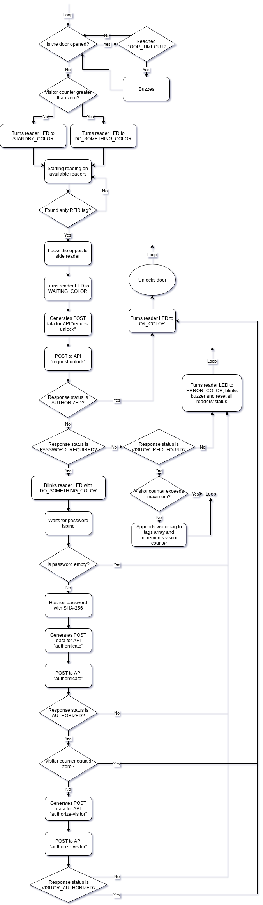

# Client

## Disclaimer
Every instruction shown below is only valid for this single project. Any changes on code, hardware or others may cause malfunctions or adding other requirements.

## Hardware requirements
For a single Arduino client you will need:
* 1x Arduino MEGA 2560;
* 1x Ethernet Shield W5100 (for communicating with server);
* 2x RFID Reader MFRC-522 (for reading UIDs);
* 2x RGB LED;
* 1x 5V active buzzer;
* 1x TCRT5000 optical sensor (for checking if the door is closed or not);
* 1x LM2596 DC/DC converter (for supplying Arduino through a 12V power source);
* 1x MOSFET IRF540N (for unlocking the door);
* 3x 150Ω resistors (for RED pins on LEDs and infra-red LED);
* 2x 220Ω resistors (for GREEN pins on LEDs);
* 2x 470Ω resistors (for BLUE pins on LEDs);
* 1x 10KΩ resistor (for LDR);
* 1x 4x3 matrix keypad (optional);
* 1x Custom shield*

*For further information on this, check the main README on the root folder of this repository.

## Implementation
A single client consists on two "blocks" of equipment. One block inside the room and, the other, outside, as shown below:

## Algorithm
The Arduino code is pretty simple and works as the diagram below:
* Setup:

* Loop:
